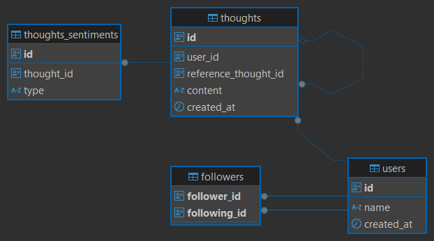
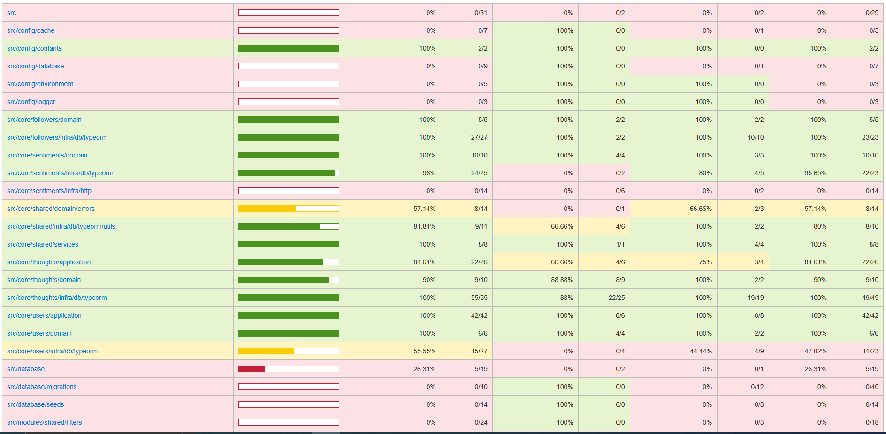

# Teste Técnico Backend (Casar.com) - Thoughts

## Sobre o Projeto

Este repositório contém a implementação do desafio técnico para a vaga de Backend. O projeto consiste em uma API 
para atender as funcionalidade do projeto Thoughts proposto no desafio técnico.

## Tecnologias Utilizadas

O projeto foi desenvolvido utilizando as seguintes tecnologias:

- NodeJS v22.13
- Framework: NestJS v11
- ORM: TypeORM
- Banco de dados: PostgreSQL
- Testes: Jest

## Diagrama ER
### 


## Dicionário de Dados

### Tabela: users
#### Descrição: Tabela referente a entidade de usuários do projeto 

#### Colunas

| Nº  | Nome da Coluna       | PK | FK | Obrigatório | Tipo da Coluna |
|----|-----------------------|----|----|-------------|----------------|
| 1  | id                    | P  |    | Y           | UUID           |
| 2  | name                  |    |    | Y           | VARCHAR(14)    |
| 3  | created_at            |    |    | Y           | TIMESTAMP      |

### Tabela: followers
#### Descrição: Tabela referente a informação de seguidores dos usuários

#### Colunas

| Nº  | Nome da Coluna       | PK | FK | Obrigatório | Tipo da Coluna |
|---- |----------------------|----|----|-------------|----------------|
| 1   | follower_id          | P  |    | Y           | UUID           |
| 2   | following_id         | P  |    | Y           | UUID           |

### Tabela: thoughts
#### Descrição: Tabela referente a entidade de pensamentos (thought). Como proposta foi idealizado que a coluna reference_thought_id seja informado para o caso de um re-repostagem de pensamento (re-thought)

#### Colunas

| Nº  | Nome da Coluna       | PK | FK | Obrigatório | Tipo da Coluna |
|----|-----------------------|----|----|-------------|----------------|
| 1  | id                    | P  |    | Y           | UUID           |
| 2  | user_id               |    | Y  | Y           | UUID           |
| 3  | reference_thought_id  |    | Y  |             | UUID           |
| 4  | content               |    |    |             | VARCHAR(200)   |
| 5  | created_at            |    |    | Y           | TIMESTAMP      |


### Tabela: thoughts_sentiments
#### Descrição: Tabela referente a informação do sentimento que representa o conteúdo do pensamento (thought)
#### Colunas

| Nº  | Nome da Coluna       | PK | FK | Obrigatório | Tipo da Coluna |
|----|-----------------------|----|----|-------------|----------------|
| 1  | id                    | P  |    | Y           | UUID           |
| 2  | thought_id            |    | Y  | Y           | UUID           |
| 3  | type                  |    | Y  |             | ENUM           |


## Configuração do projeto

1. **Clonar projeto**:
   ```bash
   git clone https://github.com/hugomatheus/thoughts-api.git
   ```

2. **Instalar dependências**:
   ```bash
   npm install
   ```

3. **Configurar variáveis de ambiente - Crie um arquivo .env na raiz do projeto e adicione as configurações necessárias**:
   ```bash
   # APP
    APP_PORT=3838
    APP_MODE=dev

    # DATABASE
    DATABASE_TYPE=postgres
    DATABASE_HOST=
    DATABASE_PORT=5432
    DATABASE_USERNAME=
    DATABASE_PASSWORD=
    DATABASE_NAME=thoughts
   ```

5. **Rodar migrations**:
  ```bash
  npm run migration:run
  ```
6. **Rodar seeds**:
  ```bash
  npm run seed:run
  ```

7. **Rodar a aplicação**:
   ```bash
   npm run start:dev
   ```
### Para o desenvolvimento foi utilizado o nvm localmente na versão 22.13 e para o banco de dados foi utlizado com docker caso deseje tem um arquivo docker-compose.yml na raiz do projeto e seguir o mesmo ambiente de desenvolvimento.


## Testes

```bash
   npm run test
```
O foco na criação dos testes foi os repositories utilizando TypeORM e para desenvolvimento destes testes foi utilizado 
o sqlite em memória. e testes dos use cases com mock.



## Funcionalidades Implementadas

### A API contém os seguintes endpoints:

##### Endpoint para informações do perfil do usuário

GET: http://localhost:3838/api/users/{id}

```bash
{
    "name": "User1",
    "createdAt": "06/03/2025",
    "followersCount": 0,
    "followingCount": 2,
    "isFollowing": false
}
```
Como proposta foi utilizado cache (em memória) para as informações que foram interpretadas que para a aplicação não teria tanto impacto se não estivesse consistente ao realizar a requisição do cliente, deixando  a informação (isFollowing) de fora do cache e sempre ser verificado o resultado diretamente no banco de dados. 

#### Endpoint para listagem de pensamentos de determinado usuário

GET: http://localhost:3838/api/users/{id}/thoughts?page=1

```bash
{
    "items": [
        {
            "id": "27049d31-4b1d-43d2-933a-adb7b1c6f7d8",
            "userId": "2279c31e-cfed-4ba2-b539-ed807f0877e3",
            "content": "Olá thought",
            "referenceThoughtId": null,
            "createdAt": "2025-03-06T18:40:17.897Z"
        },
    ],
    "page": 1,
    "perPage": 5,
    "total": 1,
    "lastPage": 1
}
```

#### Endpoint para seguir usuário:

POST: http://localhost:3838/api/users/follow

body
```bash
{
    "followerId": "2279c31e-cfed-4ba2-b539-ed807f0877e3",
    "followingId": "826844eb-9c94-4a7f-b868-b17065688aaa"
}
```
#### Endpoint para deixar de seguir usuário:

DELETE: http://localhost:3838/api/users/{id1}/unfollow/{id2}

#### Endpoint para criação de thoughts 

POST: http://localhost:3838/api/thoughts

body
```bash
{
    "userId": "2279c31e-cfed-4ba2-b539-ed807f0877e3",
    "content": "olá thought"
}
```

### Endpoint para pesquisa de thoughts

POST: http://localhost:3838/api/thoughts/feed

body
```bash
{
    "userId": "2279c31e-cfed-4ba2-b539-ed807f0877e3",
    "paginate": {
        "page": 1
    },
    "filters": {
        "following": false
    }
}
```

## Crítica

- Aprofundar e aplicar conceitos de Domain-Driven Design (DDD) e Clean Architecture: Implementar essas abordagens pode resultar em uma organização mais robusta e modular do projeto, facilitando a manutenção e evolução contínua do software.
- Banco de dados não relacional pode simplificar a estrutura e melhorar o desempenho das consultas. A capacidade de armazenar dados de forma mais flexível será uma vantagem em consultas complexas comparando com bancos relacionais.
- Afrofundar a abordagem do uso de cache.